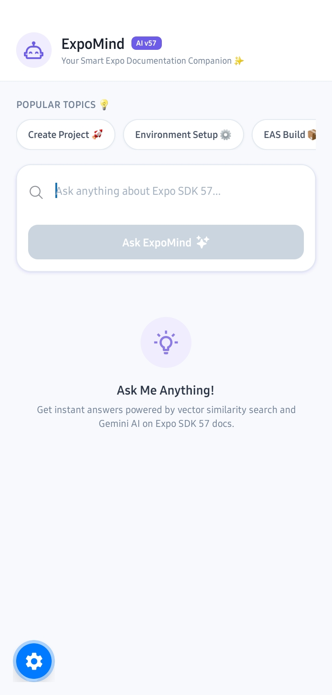
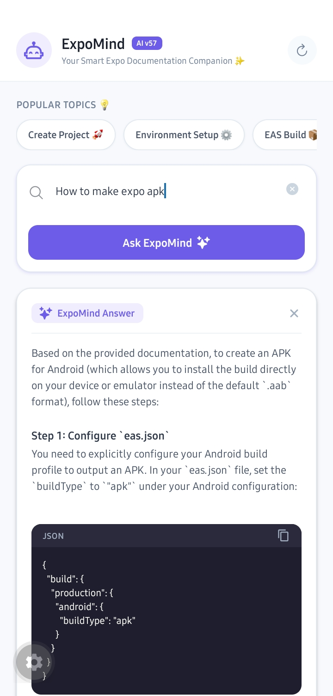
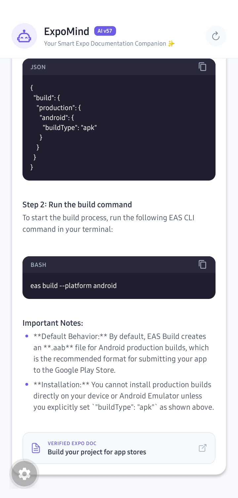
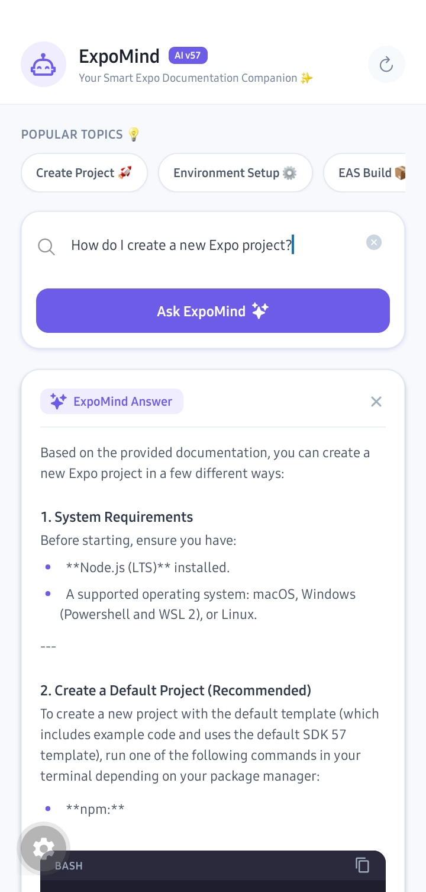
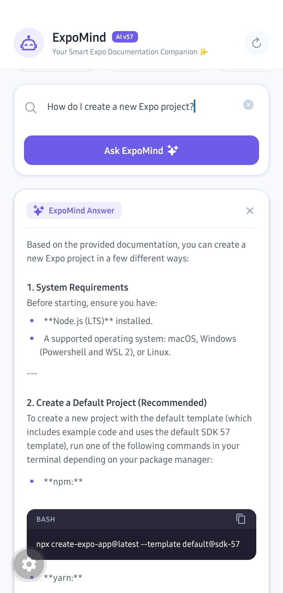
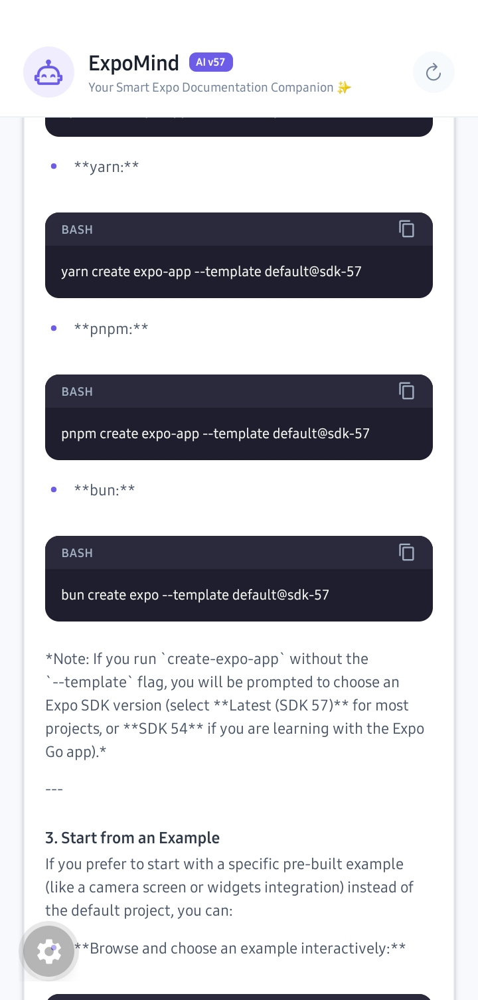

# ExpoMind

**ExpoMind** is an AI-powered mobile assistant for developers built with **React Native, Expo, and TypeScript**. It provides a documentation-focused chat experience for learning and working with **Expo SDK 57**.

The project implements a **Retrieval-Augmented Generation (RAG)** pipeline that combines **vector embeddings, similarity search, Supabase, and Gemini AI** to retrieve relevant Expo documentation and generate contextual answers.

ExpoMind was built using the concepts and architecture demonstrated in the **NotJust.Dev AI Chatbot for Expo Docs RAG tutorial**, while adapting the implementation into a standalone mobile application with its own UI, features, and Expo SDK 57 setup.

## Download APK

[**Download ExpoMind APK**](https://expo.dev/accounts/anmoly6422/projects/expomind/builds/24e386ce-4bbb-4c25-b2a9-14c9c071ec46)

Open the Expo build page above and download the Android APK.

## Screenshots

<p align="center">
  
  
  
</p>

<p align="center">
  
  
  
</p>

## Features

### AI-Powered Expo Assistant

Ask questions about Expo development and receive contextual AI-generated answers based on relevant Expo documentation.

### Retrieval-Augmented Generation (RAG)

ExpoMind uses a **RAG pipeline** to improve the relevance of AI responses.

Instead of sending a user's question directly to the AI model, the application first searches a vector database for documentation that is semantically related to the question. The retrieved content is then provided as context to Gemini AI.

This helps the model generate answers grounded in relevant Expo documentation.

### Vector Embeddings

Expo documentation is converted into **vector embeddings**, which represent the semantic meaning of the documentation as numerical vectors.

When a user asks a question, the question is also converted into an embedding and compared against the stored documentation vectors to find the most relevant content.

### Vector Similarity Search

ExpoMind performs **similarity searches** against the stored embeddings to retrieve the documentation chunks most relevant to the user's question.

This allows queries with different wording to still find related documentation based on semantic meaning rather than simple keyword matching.

### Gemini AI

The relevant documentation retrieved through the RAG pipeline is passed to **Gemini AI** as contextual information.

Gemini then generates the final response using the retrieved documentation.

### Documentation Sources

Responses can display the documentation sources used to generate the answer.

Users can tap a source card to open the corresponding Expo documentation and verify the information themselves.

### Code Formatting

AI-generated code is displayed in developer-friendly code blocks with:

* Programming language labels
* Scrollable code sections
* Monospace formatting
* Clear separation between code and explanation

### Quick Prompts

ExpoMind provides quick prompts for common Expo development tasks:

* Create a new Expo project
* Set up the Expo development environment
* Build an application using EAS Build
* Publish updates using EAS Update

### Developer-Focused UI

The application includes:

* Popular topic suggestions
* Interactive chat input
* Loading states
* Formatted AI responses
* Documentation source cards
* Clear and reset controls

## RAG Architecture

ExpoMind follows a Retrieval-Augmented Generation workflow:

```text
                ┌─────────────────────┐
                │   Expo Documentation │
                └──────────┬──────────┘
                           ↓
                ┌─────────────────────┐
                │  Text Processing    │
                └──────────┬──────────┘
                           ↓
                ┌─────────────────────┐
                │  Vector Embeddings  │
                └──────────┬──────────┘
                           ↓
                ┌─────────────────────┐
                │  Supabase / Vector  │
                │      Storage        │
                └──────────┬──────────┘
                           │
                           │ Similarity Search
                           │
User Question ─────────────┘
       ↓
Question Embedding
       ↓
Relevant Documentation
       ↓
Gemini AI
       ↓
Contextual Answer
       ↓
Documentation Sources
```

## How RAG Works in ExpoMind

### 1. Documentation Collection

Relevant Expo documentation is collected and prepared for processing.

### 2. Text Processing

The documentation is divided into smaller sections or chunks so that relevant portions can be retrieved efficiently.

### 3. Generate Embeddings

Each documentation chunk is converted into a numerical **vector embedding** representing its semantic meaning.

### 4. Store Embeddings

The generated embeddings and associated documentation content are stored in **Supabase** for retrieval.

### 5. User Question

When a user asks a question, ExpoMind generates an embedding for the question.

### 6. Similarity Search

The question embedding is compared against the stored documentation embeddings to find the most relevant documentation.

### 7. Context Retrieval

The highest-relevance documentation chunks are retrieved and supplied to Gemini as context.

### 8. AI Response

Gemini generates an answer based on the user's question and the retrieved Expo documentation.

### 9. Source Verification

The relevant documentation source is displayed so the user can verify the information.

## Tech Stack

| Technology                   | Purpose                                  |
| ---------------------------- | ---------------------------------------- |
| **React Native**             | Mobile application development           |
| **Expo SDK 57**              | Cross-platform mobile development        |
| **Expo Router**              | File-based navigation                    |
| **TypeScript**               | Type-safe development                    |
| **Supabase**                 | Backend and vector data storage          |
| **Gemini AI**                | AI response generation                   |
| **Vector Embeddings**        | Semantic representation of documentation |
| **Vector Similarity Search** | Relevant documentation retrieval         |
| **EAS Build**                | Android application builds               |

## Project Inspiration

ExpoMind was developed based on the concepts demonstrated in the **NotJust.Dev AI Chatbot for Expo Docs RAG tutorial**.

The tutorial demonstrates how to build an AI chatbot using:

* Expo documentation as the knowledge source
* Text processing and documentation chunks
* Vector embeddings
* A vector database
* Similarity searches
* AI-generated responses
* Expo and Expo Router for the application UI

ExpoMind builds on these concepts as a personal implementation and portfolio project, with a dedicated mobile UI, documentation source cards, quick prompts, code formatting, and an Expo SDK 57-focused experience.

**Tutorial:**
[AI Chatbot for Expo Docs — RAG Tutorial](https://www.notjust.dev/projects/aichatbot)

## Example Queries

```text
How do I create a new Expo project?
```

```text
How do I set up the development environment for Expo?
```

```text
How do I build my project using EAS Build?
```

```text
How do I publish updates using EAS Update?
```

## Getting Started

### 1. Clone the Repository

```bash
git clone https://github.com/Anmoly6422/expomind.git
cd expomind
```

### 2. Install Dependencies

```bash
npm install
```

### 3. Configure Environment Variables

Create a `.env` file in the project root:

```env
EXPO_PUBLIC_SUPABASE_URL=your_supabase_url
EXPO_PUBLIC_SUPABASE_ANON_KEY=your_supabase_anon_key
```

Add any additional environment variables required by your AI/backend configuration.

> Never commit private API keys, service-role keys, or other secrets to GitHub.

### 4. Start the Development Server

```bash
npx expo start
```

For a development client:

```bash
npx expo start --dev-client
```

## Building the Android APK

ExpoMind uses **EAS Build** for creating Android application builds.

```bash
npx eas build -p android --profile preview
```

The current Android preview build was generated using EAS Build.

## Project Structure

```text
expomind/
├── app/
├── assets/
├── img/
│   ├── expo1.jpg
│   ├── expo2.jpg
│   ├── expo3.jpg
│   ├── expo4.jpg
│   ├── expo5.jpg
│   └── expo6.jpg
├── src/
│   └── lib/
│       ├── supabase.ts
│       └── ragService.ts
├── app.json
├── package.json
└── README.md
```

## Future Improvements

* [ ] Add conversation history
* [ ] Improve retrieval accuracy
* [ ] Add metadata filtering to retrieval
* [ ] Improve document chunking
* [ ] Expand documentation coverage
* [ ] Add support for additional Expo SDK versions
* [ ] Improve offline and error handling
* [ ] Add more developer-focused quick prompts
* [ ] Publish the application on the Google Play Store
* [ ] Add iOS support

## Learning Outcomes

Through this project, I explored and implemented concepts including:

* React Native mobile development
* Expo and Expo Router
* TypeScript
* Retrieval-Augmented Generation (RAG)
* Vector embeddings
* Vector similarity search
* AI-powered application development
* Supabase integration
* Gemini AI integration
* Documentation retrieval
* EAS Build and Android deployment

## Author

**Anmol Yadav**

B.Tech Computer Science & Engineering

[GitHub](https://github.com/Anmoly6422)

[LinkedIn](https://www.linkedin.com/in/anmol-yadav-35ba40269/)

## License

This project was developed for educational and portfolio purposes.
